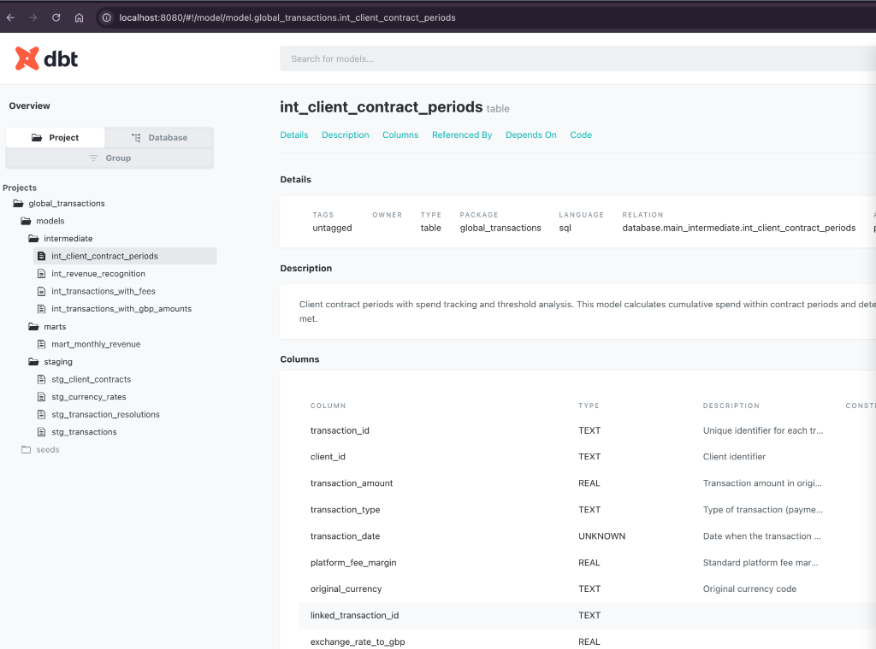
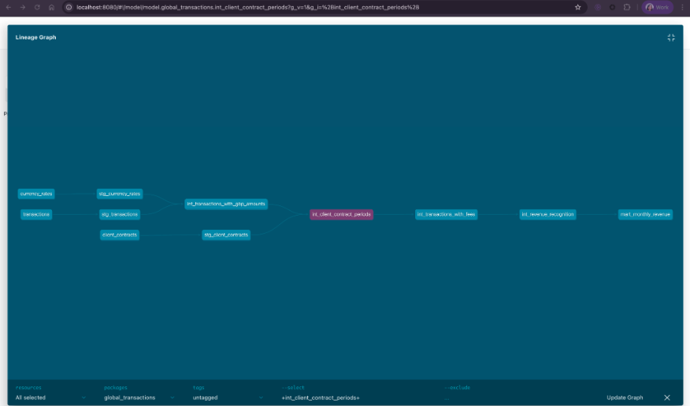
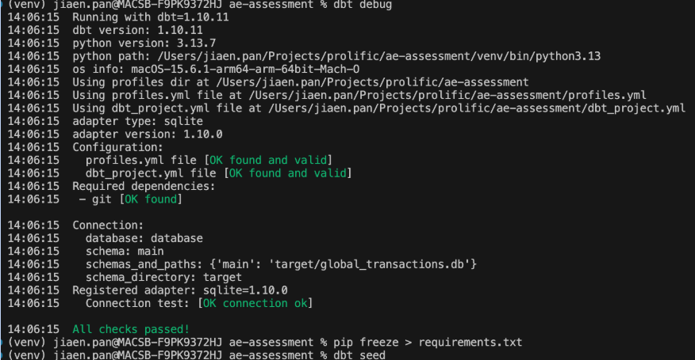
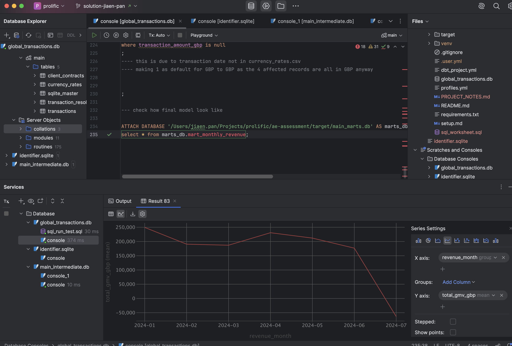

# dbt project notes

## random stuff I learned

- dbt-sqlite config - it creates diff db files for each schema:
  * main_staging.db for staging models
  * main_intermediate.db for intermediate stuff  
  * main_marts.db for the final tables
  * global_transactions.db has all the seed data

- i kept hitting "database locked" errors
  * fix: rm target/*.db then start fresh 
  * use lsof to check what's locking it

- sqlite3 syntax learning
  * can't reference column alias in same SELECT like snowflake
  * had to use CTEs or repeat expressions
  * need ATTACH DATABASE for cross-db joins


## models

staging:
- stg_transactions - cleaned up transaction data
- stg_client_contracts - all contract info
- stg_currency_rates - exchange rates 
- stg_transaction_resolutions - status data

intermediate:
- int_transactions_with_gbp_amounts - converted currencies
- int_client_contract_periods - tracked contract periods
- int_transactions_with_fees - calculated fees with discounts
- int_revenue_recognition - applied rev rec rules

marts:
- mart_monthly_revenue - monthly metrics by client

## Key learning from resolving issue

1) tables weren't showing up after dbt run
   - they were in separate db files

2) some columns missing from final SQL
   - files weren't saving correctly due to invisible characters/ encoding
   - used terminal instead of UI to edit

3) schema docs giving warnings
   - had to update to new syntax with arguments: wrapper

4) git was pushing to wrong place
   - reset remote URL to my repo
   - fixed .gitignore

5) queries not working cross-db
   - solved with ATTACH DATABASE commands
   ```
   ATTACH DATABASE 'target/main_staging.db' AS staging_db;
   ATTACH DATABASE 'target/main_intermediate.db' AS intermediate_db; 
   ATTACH DATABASE 'target/main_marts.db' AS marts_db;
   ```
   - then query like: `SELECT * FROM staging_db.stg_transactions;`
   - or for intermediate: `SELECT * FROM int_revenue_recognition;` (no prefix needed)

## revenue recognition logic

- fraud: no revenue
- chargebacks: negative revenue if unresolved 
- refunds: negative platform fee
- payments: full platform fee as revenue

## screenshots

### dbt docs UI

*dbt documentation interface showing the project structure and model relationships*

### model lineage graph 

*data flow visualization showing how models connect from staging → intermediate → marts*

### dbt debug output

*configuration validation showing the project is properly set up with SQLite*

### monthly revenue visualization

*chart showing monthly GMV trends by client from the final marts model*

## useful commands 

```
# run stuff
dbt run
dbt run -m model_name
dbt test

# docs
dbt docs generate
dbt docs serve

# db stuff
rm target/*.db  # nuke everything if locked
lsof target/*.db  # check for locks

# check if tables exist
sqlite3 target/main_intermediate.db ".tables"

# see what's in the tables
sqlite3 target/main_intermediate.db "SELECT * FROM int_revenue_recognition LIMIT 5;"

# connect to all dbs at once
sqlite3 target/main_intermediate.db
> ATTACH DATABASE 'target/main_staging.db' AS staging_db;
> ATTACH DATABASE 'target/main_marts.db' AS marts_db;
> SELECT * FROM staging_db.stg_transactions LIMIT 5;
```

## todo / next steps
- add more metrics
- better contract analysis
- fix revenue forecasting
- customer segmentation

## example fix for sqlite syntax issues

this doesn't work in sqlite:
```sql
SELECT 
  date(contract_start_date, '+' || contract_duration_months || ' months') as contract_end_date,
  CASE WHEN transaction_date < contract_end_date THEN 1 ELSE 0 END
```

had to do this instead:
```sql
SELECT
  t.*,
  c.*,
  CASE 
    WHEN c.contract_start_date IS NOT NULL
    AND t.transaction_date >= c.contract_start_date
    AND t.transaction_date < date(contract_start_date, '+' || contract_duration_months || ' months')
    THEN 1
    ELSE 0
  END as has_active_contract
FROM int_transactions_with_gbp_amounts t
LEFT JOIN client_contracts c ON t.client_id = c.client_id
```

## random notes to self
- make sure to test revenue stuff more
- don't forget git is weird with forks
- remember .gitignore needs updating
